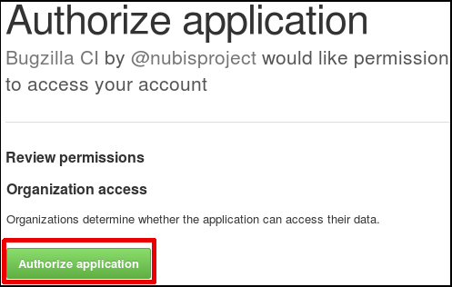
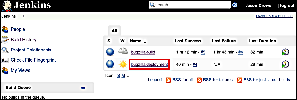
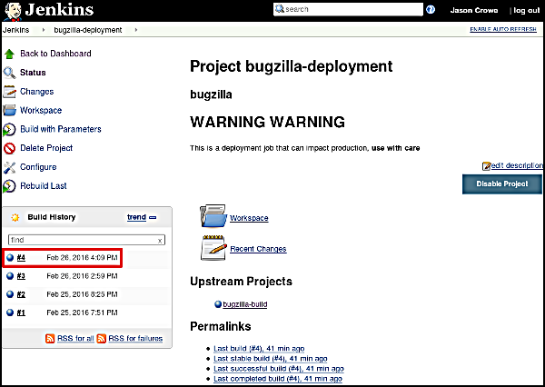
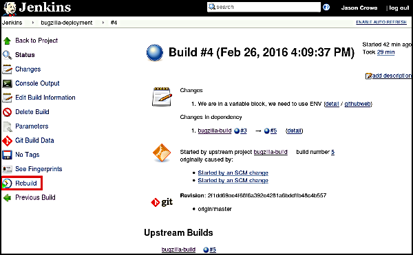
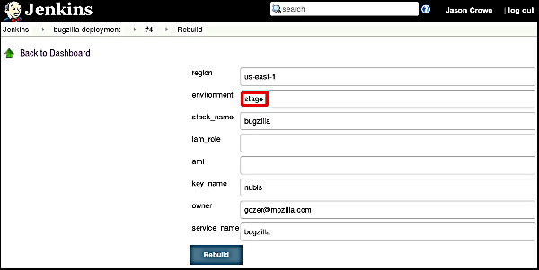
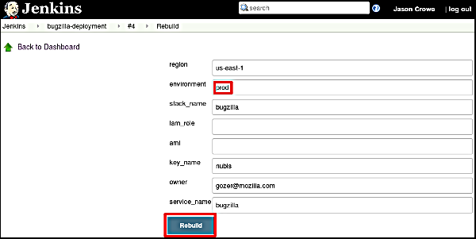

# bugzilla.mozilla.org
This is a nubis deployment repository for BMO (bugzilla.mozilla.org)

## Prerequisites
If you are new to the Nubisproject you will need to set up some [prerequisites](https://github.com/Nubisproject/nubis-docs/blob/master/PREREQUISITES.md). 

## Layout
It is important to understand that everything is deployed in a layers. The "stack" if you will goes &something like this:
 - [Nubis platform components](README.md#upgrading-the-platform)
 - [Bugzilla deployment code](README.md#updating-the-deployment)
 - [Bugzilla application code](README.md#updating-the-application)

We will walk through updating each layer individually, however any time you are updating a lower layer you should test each higher layer.

You will see that updates at all layers follow a similar git style work-flow. For the deployment layer and the application layer the actual deployment mechanism is a Jenkins instance. When you land code on the deployment repositories' master branch it will automatically be deployed into stage.

## Upgrading the platform
At the present time the Nubis team will update the platform components. Once we have upgraded to the 1.0.3 release the Bugzilla team will take responsibility for updating the platform components.

Instructions for updating the Nubis platform can be found in the [upgrading](https://github.com/nubisproject/nubis-docs/UPGRADING.md) doc.

## Updating the deployment
Updating the deployment is accomplished by following a normal git work-flow:
 1. [Checkout the deployment repository](README.md#checkout-the-deployment-repository)
 1. [Initilize the application code submodule](README.md#initialize-the-application-code-submodule)
 1. [Make necessary changes](README.md#make-necessary-changes)
 1. [Check deployment code into github](README.md#check-deployment-code-into-github)
 1. [Test deployment in stage](README.md#test-deployment-in-stage)
 1. [Deploy the code into production](README.md#deploy-the-code-into-production)

## Updating the application
Fortunately, updating the application code is exactly the same as updating the deployment code with one notable exception:
 1. [Checkout the deployment repository](README.md#checkout-the-deployment-repository)
 1. [Initialize the application code submodule](README.md#initialize-the-application-code-submodule)
 1. ~~[Make necessary changes](README.md#make-necessary-changes)~~
 1. [Check deployment code into github](README.md#check-deployment-code-into-github)
 1. [Test deployment in stage](README.md#test-deployment-in-stage)
 1. [Deploy the code into production](README.md#deploy-the-code-into-production)

## Checkout the deployment repository
You will want to grab the latest [code](https://github.com/gozer/bugzilla.mozilla.org)
```bash
git clone git@github.com:gozer/bugzilla.mozilla.org.git
```

## Initialize the application code submodule
The application code is included in this deployment repository as a git submodule. To update to the latest application code you simply update the git submodule.
```bash
git submodule update --init --recursive
```

## Make necessary changes
If you need to make any changes to the deployment code (EC2 instances, RDS, etc...) you do that here.

## Check deployment code into GitHub
Once you have updated the application code, the deployment code, or both, all you need to do is check these changes into the deployment repository. You can either do that directly or submit a pull request depending on your work-flow.
```bash
git add [whatever you updated]
git commit
git push
git pull-request (If you have [hub](https://github.com/github/hub#git--hub--github) installed)
```

## Test deployment in stage
Once your code has landed on master, Jenkins will automatically pull in the new code, rebuild AMIs and deploy them into the stage environment. After a few minutes the new deployment will be ready for testing.

You can see what is running in stage visiting [this](https://www.bugzilla-stage.stage.us-east-1.plan-b-bugzilla.nubis.allizom.org/) url.

## Deploy the code into production
After you have completed any necessary tests in stage you can push to production (based on your teams process). You simply log into the Jenkins instance and ...

#### Login to Jenkins
Start by visiting the [Jenkins URL](https://ci.bugzilla.admin.us-east-1.plan-b-bugzilla.nubis.allizom.org) and then log in.


#### Authorize GitHub Authentication
If this is your first time logging in to this Jenkins instance you will be prompted to allow Jenkins to authorize you against GitHub. It will look similar to this (Note: I have removed some of the details for brevity).



#### bugzilla-deployment
In Jenkins click on the 'bugzilla-deployment' link to go to the deployment job.



#### Latest Successful Build
Locate the latest successful build. This is identified by a blue dot next to the build (red for failed builds). Alternately you can select any previous successful build to "roll back" to that build.



#### Rebuild
Select the Rebuild link. As this job has already been executed against stage you are simply redeploying to prod.



#### Stage -> Prod
In the text input box labeled 'environment', change stage to prod.



#### Execute Rebuild
Click on the 'Rebuild' button to execute the job and deploy this build to prod.



### Test Prod
You can see what is running in prod by visiting [this](https://www.bugzilla-prod.prod.us-east-1.plan-b-bugzilla.nubis.allizom.org/) url. Note that changes to the prod deployment will affect the instance running in scl3. __You are making a production change.__

## Confd settings
These are the settings that are not set automatically and can be optionally set in Consul under */<stack-name>/<environment>/<config>/*

 * BitlyToken
 * GitHubClientID
 * GitHubClientSecret
 * HoneyPotAPIKey
 * InboundProxies
 * ShadowDBName
 * ShadowDBHost
 * ShadowDBPort
 * SSLRedirect
 * LDAPCheck/
  * LDAPServer (pm-ns.mozilla.org)
  * LDAPSCheme (ldap)
  * LDAPUser   (uid=bind-bmo,ou=logins,dc=mozilla)
  * LDAPPassword
  * BugzillaAPIKey
 * SMTP/
  * SESServer
  * SESUser
  * SESPassword
